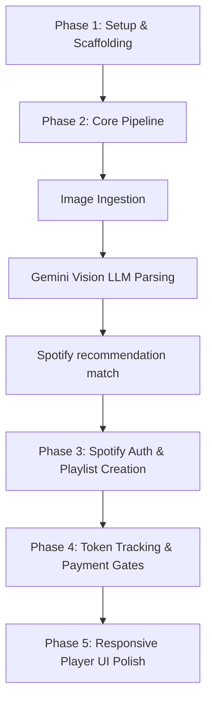

# Implementation Plan: Playlist_pic (Phased Architecture)

This document outlines the design and step-by-step phased roadmap for building **Playlist_pic**, prioritizing the core pipeline first (Image Ingestion -> LLM Parsing -> Spotify Match) before adding the monetization gates.

---

## User Review Required

> [!IMPORTANT]
> **Phased Roadmap Priority**: 
> 1. We will establish the Express infrastructure and basic database connection first.
> 2. Then, we implement the core pipeline (accepting an image upload, querying Gemini Flash, and resolving Spotify recommendations).
> 3. After the core pipeline works end-to-end, we will implement playlist saving, followed by the Spotify OAuth user login, database logging, token tracking, and mock payment gates.

---

## Phased Development Roadmap



### Phase 1: Setup & Scaffolding
- Initialize project with `package.json`, set up folders and database connection (`src/config/db.js`).
- Create environment templates (`.env.example`).

### Phase 2: Core Pipeline (Image Ingestion -> LLM Parsing -> Spotify Match)
- **Image Ingestion**: Create upload endpoint with Multer to accept image files.
- **LLM Parsing**: Integrate Gemini Flash to parse visual features and map to audio features (Valence, Energy, Acousticness, seed genres) with rigid JSON schema enforcement.
- **Spotify Match**: Use a backend client credentials token (or Spotify account developer credentials) to fetch tracks matching the parsed parameters (`GET /v1/recommendations`).
- **Basic UI Validation**: Let users upload an image and see the matching songs next to it.

### Phase 3: OAuth Login & Playlist Creation
- Implement user authentication (Spotify OAuth 2.0 redirection pipeline).
- Store `access_token` and `refresh_token` in SQLite `users` table.
- Implement Spotify Playlist generation (`POST /v1/users/{user_id}/playlists` followed by `POST /v1/playlists/{playlist_id}/tracks`).

### Phase 4: Freemium Token Model & Payments
- Track token balances in SQLite for each user.
- Apply middleware to check and deduct tokens on generation.
- Implement mock purchase endpoints to buy token packs or upgrade to Premium.

### Phase 5: Responsive Audio-Visual Player UI
- Design the final gorgeous, responsive player dashboard.
- Display the source image and previewable Spotify tracks in a side-by-side or stacked grid layout.
- Include smooth CSS transition states, token count badges, and premium toggles.

---

## Technical Specifications

### SQLite Schema Design
```sql
CREATE TABLE IF NOT EXISTS users (
    spotify_id TEXT PRIMARY KEY,
    display_name TEXT,
    email TEXT,
    spotify_access_token TEXT,
    spotify_refresh_token TEXT,
    spotify_token_expires_at INTEGER,
    tier TEXT DEFAULT 'free',
    tokens INTEGER DEFAULT 3,
    created_at DATETIME DEFAULT CURRENT_TIMESTAMP
);

CREATE TABLE IF NOT EXISTS generations (
    id TEXT PRIMARY KEY,
    user_id TEXT,
    image_path TEXT,
    dominant_colors TEXT,
    environmental_context TEXT,
    emotional_vibe TEXT,
    seed_genres TEXT,
    valence REAL,
    energy REAL,
    acousticness REAL,
    playlist_id TEXT,
    playlist_name TEXT,
    playlist_url TEXT,
    created_at DATETIME DEFAULT CURRENT_TIMESTAMP,
    FOREIGN KEY(user_id) REFERENCES users(spotify_id)
);
```

### Gemini Flash JSON Output Structure
```json
{
  "dominantColorPalette": ["neon", "vintage", "monochrome", "pastel", "dark"],
  "environmentalContext": "rainy streets, sunny beach, forest, club, minimalist room",
  "emotionalVibe": "melancholic, high-energy, nostalgic, euphoric, dark",
  "seedGenres": ["indie", "electronic", "pop"],
  "valence": 0.45,
  "energy": 0.72,
  "acousticness": 0.15
}
```

---

## Verification Plan

1. **Verify Core Pipeline**: Run a test script to post an image to `/api/process-image` and receive the visual analysis and recommendation list.
2. **Verify Auth & Save**: Complete user login flow, upload image, check that a playlist is generated and successfully added to the user's Spotify library.
3. **Verify Tokens**: Ensure a free-tier user is blocked after 3 uploads until mock payment occurs.
